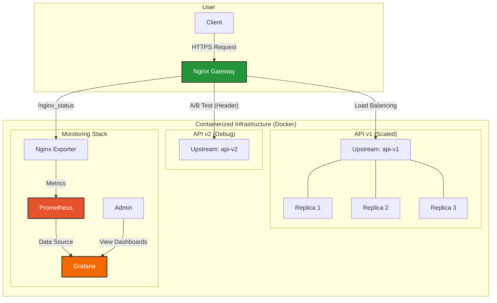

## / Exam Instructions
<details>
<summary>🇬🇧 English Version</summary>

### MLOps Exam: Advanced Deployment with Nginx 🚀

#### Context

For this exam, you will implement a robust and secure MLOps architecture. The core of the project is to use Nginx as an API Gateway to serve a Machine Learning model via a FastAPI API. You will not only make the service functional but also implement advanced features essential for production: scalability, security, and modern deployment strategies.

#### Project Objectives

Your mission is to set up a complete containerized architecture that meets the following objectives:

1.  **Reverse Proxy**: Nginx must act as the single point of entry and route traffic to the appropriate API services.

2.  **Load Balancing**: The main API (`api-v1`) must be deployed in multiple instances (3 replicas) to ensure high availability and load distribution.

3.  **HTTPS Security**: All external communications must be encrypted via HTTPS. You will generate self-signed certificates for this purpose. Plain HTTP traffic must be automatically redirected to HTTPS.

4.  **Access Control**: Access to the prediction endpoint (`/predict`) must be protected by basic authentication (username/password).

5.  **Rate Limiting**: To protect the API from overload, the `/predict` endpoint must limit the number of requests (e.g., 10 requests/second per IP).

6.  **A/B Testing**: You will deploy two versions of the API.
    *   `api-v1`: The standard version.
    *   `api-v2`: A "debug" version that returns additional information.
    *   Nginx must route traffic to `api-v2` **only if** the request contains the `X-Experiment-Group: debug` HTTP header. Otherwise, traffic should be routed to `api-v1`.

7.  **Monitoring (Bonus)**: Set up a monitoring stack with Prometheus and Grafana to collect and visualize Nginx metrics.

#### Target Architecture

The following diagram illustrates the complete architecture you need to build. Nginx acts as a central gateway, managing traffic to the different API versions and exposing metrics for monitoring.



#### Target Project Structure

Here is the file tree you should aim to have at the end:

```sh
. 
├── Makefile
├── README.md
├── README_student.md
├── data
│   └── tweet_emotions.csv
├── deployments
│   ├── nginx
│   │   ├── Dockerfile
│   │   ├── certs
│   │   │   ├── nginx.crt
│   │   │   └── nginx.key
│   │   └── nginx.conf
│   └── prometheus
│       └── prometheus.yml
├── docker-compose.yml
├── model
│   └── model.joblib
├── src
│   ├── api
│   │   ├── requirements.txt
│   │   ├── v1
│   │   │   ├── Dockerfile
│   │   │   └── main.py
│   │   └── v2
│   │       ├── Dockerfile
│   │       └── main.py
│   └── gen_model.py
└── tests
    └── run_tests.sh
```

#### Deliverables

You must submit a `.zip` or `.tar.gz` archive containing your entire project, including:

-   **All necessary `Dockerfiles`** to build the images for your services.
-   The **`docker-compose.yml`** file orchestrating all services (Nginx, api-v1, api-v2, monitoring).
-   The complete **`nginx.conf`** file with all required directives.
-   Configuration and security files (`.htpasswd`, SSL certificates, `prometheus.yml`).
-   The source code for both API versions.
-   A **`Makefile`** with clear commands for `start-project`, `stop-project`, and `test`.
-   A test script (`tests/run_tests.sh`) that automatically validates the key features.

#### Evaluation Criteria

**Important:** The final validation of your project will be done by running the `make test` command. It must run without errors, and all tests must pass successfully.

-   **Functionality**: All features (1 through 6) are implemented and work correctly.
-   **Code Quality**: Configuration files (`nginx.conf`, `docker-compose.yml`) are clear, commented where necessary, and well-structured.
-   **Reproducibility**: The project can be launched without errors using `make start-project`.
-   **Automation**: The `Makefile` and test script are effective and allow for easy project validation.
-   **Documentation Clarity**: The main `README.md` clearly explains the project's architecture and usage.

Good luck! 🚀

</details>
